<p align="center">
  <picture>
    <source media="(prefers-color-scheme: dark)" srcset="assets/banner-dark.svg">
    <source media="(prefers-color-scheme: light)" srcset="assets/banner.svg">
    
  </picture>
</p>

# SKILL SKILL

**English** | [中文](README.zh-CN.md)

[](LICENSE)
[](CONTRIBUTING.md)
[]()

> Take a working AI rule file from local draft to a published GitHub repo.

## Install

```bash
git clone https://github.com/haorantang97/SKILL-SKILL.git
cd SKILL-SKILL
```

Each `SKILL.md` is plain markdown with YAML front matter. Drop it into whichever agent you use:

| Agent | Where to put it |
|---|---|
| Claude Code | `cp -r skills/* ~/.claude/skills/` |
| Cursor | `cp skills/{name}/SKILL.md ~/your-project/.cursor/rules/{name}.mdc` |
| Windsurf | `cat skills/{name}/SKILL.md >> ~/your-project/.windsurfrules` |
| GitHub Copilot | `cp skills/{name}/SKILL.md ~/your-project/.github/copilot-instructions.md` |
| Codex / AGENTS.md | `cp skills/{name}/SKILL.md ~/your-project/AGENTS.md` |

Skills are independent. Install only the ones you want.

## What it does

This bundle splits the publish-to-GitHub workflow into independent skills, one per step. Run them in order through the orchestrator, or call any single one when you only need that part.

## Flow

```mermaid
flowchart LR
    A([your rule file]) --> B[polish-rule-content]
    B --> C[write-readme]
    C --> D[scaffold-repo-files]
    D --> E[create-visual-assets]
    E --> F[publish-to-github]
    F --> G([live repo])
    G -. optional .-> H[submit-to-directories]
    H -.-> I([awesome-list PRs])

    classDef step fill:#0f172a,color:#f8fafc,stroke:#475569,stroke-width:1px;
    classDef io fill:#f1f5f9,color:#0f172a,stroke:#94a3b8,stroke-width:1px;
    class B,C,D,E,F,H step;
    class A,G,I io;
```



## Skills

### Orchestrator

- **[publish-skill-bundle](skills/publish-skill-bundle/SKILL.md)** — Routes through the pipeline in order; the entry point when you have a rule file and want to publish end to end

### Pipeline

- **[polish-rule-content](skills/polish-rule-content/SKILL.md)** — Rewrites the description with the five-segment method, restructures the body, applies the de-AI checklist
- **[write-readme](skills/write-readme/SKILL.md)** — Writes README.md with banner placeholder, badges, multi-platform install commands, and content list
- **[scaffold-repo-files](skills/scaffold-repo-files/SKILL.md)** — Creates LICENSE, CONTRIBUTING.md, .github/PULL_REQUEST_TEMPLATE.md, and the directory structure
- **[create-visual-assets](skills/create-visual-assets/SKILL.md)** — Generates assets/banner.svg, banner-dark.svg, and the three standard badges
- **[publish-to-github](skills/publish-to-github/SKILL.md)** — Runs git init, the initial commit, gh repo create, and sets topics on the live repo
- **[submit-to-directories](skills/submit-to-directories/SKILL.md)** — Submits the live repo to awesome-lists via the fork → PR flow

## File format

```
skills/{name}/SKILL.md
```

YAML front matter (`name`, `description`, `license`) followed by markdown:

```yaml
---
name: skill-name
description: "Five-segment trigger description. See skills/polish-rule-content."
license: CC0-1.0
---

## Quick Start
...
```

## Contributing

See [CONTRIBUTING.md](CONTRIBUTING.md).

## License

CC0 1.0 Universal. See [LICENSE](LICENSE).
