<p align="center">
  <picture>
    <source media="(prefers-color-scheme: dark)" srcset="assets/banner-dark.svg">
    <source media="(prefers-color-scheme: light)" srcset="assets/banner.svg">
    
  </picture>
</p>

# SKILL SKILL

[English](README.md) | **中文**

[](LICENSE)
[](CONTRIBUTING.md)
[]()

> 把一个跑通的 AI 规则文件，从本地草稿做成 GitHub 上发布质量的 repo。

## 安装

```bash
git clone https://github.com/haorantang97/SKILL-SKILL.git
cd SKILL-SKILL
```

每个 `SKILL.md` 都是带 YAML front matter 的 markdown。装进你用的 agent：

| Agent | 放哪里 |
|---|---|
| Claude Code | `cp -r skills/* ~/.claude/skills/` |
| Cursor | `cp skills/{name}/SKILL.md ~/your-project/.cursor/rules/{name}.mdc` |
| Windsurf | `cat skills/{name}/SKILL.md >> ~/your-project/.windsurfrules` |
| GitHub Copilot | `cp skills/{name}/SKILL.md ~/your-project/.github/copilot-instructions.md` |
| Codex / AGENTS.md | `cp skills/{name}/SKILL.md ~/your-project/AGENTS.md` |

skill 之间相互独立，只装你要的那个就行。

## 这是什么

这套 skill 把"把规则文件发到 GitHub"这件事拆成独立的几步，每个 skill 管一步。从调度入口按顺序跑，或者只缺哪一步就单独叫哪一个。

## 流程

```mermaid
flowchart LR
    A([your rule file]) --> B[polish-rule-content]
    B --> C[write-readme]
    C --> D[scaffold-repo-files]
    D --> E[create-visual-assets]
    E --> F[publish-to-github]
    F --> G([live repo])
    G -. optional .-> H[submit-to-directories]
    H -.-> I([awesome-list PRs])

    classDef step fill:#0f172a,color:#f8fafc,stroke:#475569,stroke-width:1px;
    classDef io fill:#f1f5f9,color:#0f172a,stroke:#94a3b8,stroke-width:1px;
    class B,C,D,E,F,H step;
    class A,G,I io;
```



## Skill 清单

### 调度入口

- **[publish-skill-bundle](skills/publish-skill-bundle/SKILL.md)** — 按顺序串起流水线；你手里有规则文件、要从头发到 GitHub 时调它

### 流水线

- **[polish-rule-content](skills/polish-rule-content/SKILL.md)** — 用五段式重写 description，重构正文，跑去 AI 味检查清单
- **[write-readme](skills/write-readme/SKILL.md)** — 写 README.md，含 banner 占位、徽章、多平台安装命令、内容清单
- **[scaffold-repo-files](skills/scaffold-repo-files/SKILL.md)** — 生成 LICENSE、CONTRIBUTING.md、.github/PULL_REQUEST_TEMPLATE.md 和目录结构
- **[create-visual-assets](skills/create-visual-assets/SKILL.md)** — 生成 assets/banner.svg、banner-dark.svg 和三个标配徽章
- **[publish-to-github](skills/publish-to-github/SKILL.md)** — 跑 git init、首次提交、gh repo create，并给仓库设 Topics
- **[submit-to-directories](skills/submit-to-directories/SKILL.md)** — 走 fork → PR 流程把仓库提交到 awesome-list

## 文件格式

```
skills/{name}/SKILL.md
```

YAML front matter（`name`、`description`、`license`）加 markdown：

```yaml
---
name: skill-name
description: "五段式触发描述。格式见 skills/polish-rule-content。"
license: CC0-1.0
---

## Quick Start
...
```

## 贡献

见 [CONTRIBUTING.zh-CN.md](CONTRIBUTING.zh-CN.md)。

## License

CC0 1.0 Universal。见 [LICENSE](LICENSE)。
